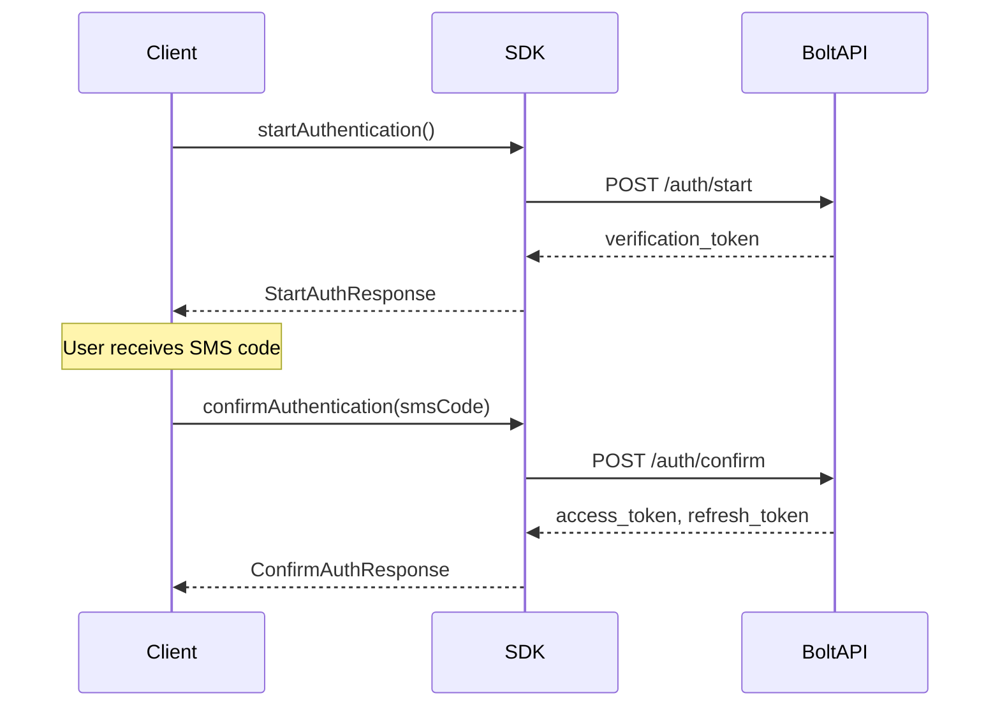
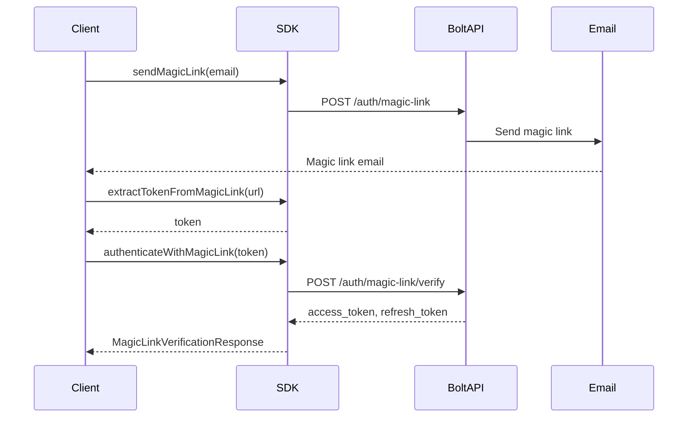

# Authentication Guide

This guide provides comprehensive information about authentication methods available in the Bolt Driver API SDK.

## Table of Contents

- [Overview](#overview)
- [SMS Authentication](#sms-authentication)
- [Magic Link Authentication](#magic-link-authentication)
- [Token Management](#token-management)
- [Error Handling](#error-handling)
- [Best Practices](#best-practices)

## Overview

The Bolt Driver API SDK supports two primary authentication methods:

1. **SMS Authentication** - Primary method using phone number and SMS verification
2. **Magic Link Authentication** - Fallback method using email and magic link

Both methods result in the same authentication state and provide access to all API endpoints.

## SMS Authentication

SMS authentication is the primary method for driver authentication. It requires a valid phone number and involves a two-step process.

### Step 1: Start Authentication

```typescript
import { BoltDriverAPI, DeviceInfo, AuthConfig, Credentials } from 'bolt-driver-api';

const deviceInfo: DeviceInfo = {
  deviceId: '550e8400-e29b-41d4-a716-446655440000',
  deviceType: 'iphone',
  deviceName: 'iPhone17,3',
  deviceOsVersion: 'iOS18.6',
  appVersion: 'DI.116.0'
};

const authConfig: AuthConfig = {
  authMethod: 'phone',
  brand: 'bolt',
  country: 'pl',
  language: 'en-GB',
  theme: 'dark'
};

const credentials: Credentials = {
  phone: '+48123456789',
  driver_id: 'driver_123',
  session_id: 'session_123'
};

const api = new BoltDriverAPI(deviceInfo, authConfig);

try {
  const authResponse = await api.startAuthentication(authConfig, deviceInfo, credentials);
  console.log('Verification token:', authResponse.data?.verification_token);
} catch (error) {
  if (error.code === 299) {
    console.log('SMS limit reached, use magic link instead');
  }
}
```

### Step 2: Confirm Authentication

```typescript
// After receiving SMS code
const smsCode = '123456';

const updatedCredentials: Credentials = {
  ...credentials,
  verification_token: authResponse.data?.verification_token,
  verification_code: smsCode
};

try {
  const confirmResponse = await api.confirmAuthentication(
    authConfig,
    deviceInfo,
    updatedCredentials,
    smsCode
  );
  
  console.log('Authentication successful!');
  console.log('Access token:', confirmResponse.data?.access_token);
} catch (error) {
  console.error('Authentication failed:', error.message);
}
```

### SMS Authentication Flow



## Magic Link Authentication

Magic link authentication is used as a fallback when SMS limits are reached or when email is preferred.

### Step 1: Send Magic Link

```typescript
try {
  await api.sendMagicLink('driver@example.com');
  console.log('Magic link sent to email');
} catch (error) {
  console.error('Failed to send magic link:', error.message);
}
```

### Step 2: Extract Token and Authenticate

```typescript
// After receiving magic link email
const magicLinkUrl = 'https://partners.bolt.eu/...';

// Extract token from URL
const token = BoltDriverAPI.extractTokenFromMagicLink(magicLinkUrl);

// Prepare GPS information
const gpsInfo: GpsInfo = {
  latitude: 52.237049,
  longitude: 21.017532,
  accuracy: 10,
  bearing: 0,
  speed: 0,
  timestamp: Math.floor(Date.now() / 1000),
  age: 0,
  accuracyMeters: 10,
  adjustedBearing: 0,
  bearingAccuracyDeg: 0,
  speedAccuracyMps: 0,
  gps_speed_accuracy: 0
};

try {
  const authResponse = await api.authenticateWithMagicLink(token, deviceInfo, gpsInfo);
  console.log('Magic link authentication successful!');
} catch (error) {
  console.error('Magic link authentication failed:', error.message);
}
```

### Magic Link Authentication Flow



## Token Management

The SDK automatically handles token management including storage, refresh, and validation.

### Automatic Token Storage

```typescript
import { FileTokenStorage } from 'bolt-driver-api';

// Use file-based token storage (default)
const tokenStorage = new FileTokenStorage('.bolt-token.json');
const api = new BoltDriverAPI(deviceInfo, authConfig, {}, tokenStorage);
```

### Custom Token Storage

```typescript
import { TokenStorage, SessionInfo } from 'bolt-driver-api';

class CustomTokenStorage implements TokenStorage {
  async saveToken(token: string, sessionInfo: SessionInfo): Promise<void> {
    // Save to your preferred storage (database, Redis, etc.)
    await this.saveToDatabase({ token, sessionInfo });
  }
  
  async loadToken(): Promise<{ token: string; sessionInfo: SessionInfo } | null> {
    // Load from your preferred storage
    return await this.loadFromDatabase();
  }
  
  async clearToken(): Promise<void> {
    // Clear from your preferred storage
    await this.clearFromDatabase();
  }
}

const api = new BoltDriverAPI(deviceInfo, authConfig, {}, new CustomTokenStorage());
```

### Token Validation

```typescript
// Check if currently authenticated
if (api.isAuthenticated()) {
  console.log('User is authenticated');
}

// Validate current token
const isValid = await api.validateToken();
if (isValid) {
  console.log('Token is valid');
} else {
  console.log('Token is invalid or expired');
}
```

## Error Handling

The SDK provides specific error types for different authentication failures.

### Common Error Types

```typescript
import {
  SmsLimitError,
  InvalidPhoneError,
  DatabaseError,
  InvalidSmsCodeError,
  NotAuthorizedError
} from 'bolt-driver-api';

try {
  await api.startAuthentication(authConfig, deviceInfo, credentials);
} catch (error) {
  if (error instanceof SmsLimitError) {
    console.log('SMS limit reached, try magic link');
    await api.sendMagicLink('driver@example.com');
  } else if (error instanceof InvalidPhoneError) {
    console.log('Invalid phone number format');
  } else if (error instanceof DatabaseError) {
    console.log('Server database error, retry later');
  } else {
    console.log('Unexpected error:', error.message);
  }
}
```

### Error Codes

| Code | Error Type | Description |
|------|------------|-------------|
| 299 | SmsLimitError | SMS sending limit reached |
| 300 | InvalidPhoneError | Invalid phone number format |
| 301 | DatabaseError | Database-related error |
| 302 | InvalidSmsCodeError | Invalid or expired SMS code |
| 401 | UnauthorizedError | Authentication required |
| 503 | NotAuthorizedError | Authorization failed |

## Best Practices

### 1. Handle Authentication Errors Gracefully

```typescript
async function authenticateWithFallback(api: BoltDriverAPI, credentials: Credentials) {
  try {
    // Try SMS authentication first
    const authResponse = await api.startAuthentication(authConfig, deviceInfo, credentials);
    const smsCode = await getSmsCodeFromUser();
    await api.confirmAuthentication(authConfig, deviceInfo, {
      ...credentials,
      verification_token: authResponse.data?.verification_token,
      verification_code: smsCode
    }, smsCode);
  } catch (error) {
    if (error instanceof SmsLimitError) {
      // Fallback to magic link
      const email = await getEmailFromUser();
      await api.sendMagicLink(email);
      const magicLink = await getMagicLinkFromUser();
      const token = BoltDriverAPI.extractTokenFromMagicLink(magicLink);
      await api.authenticateWithMagicLink(token, deviceInfo, gpsInfo);
    } else {
      throw error;
    }
  }
}
```

### 2. Implement Token Refresh

```typescript
// The SDK automatically handles token refresh
// But you can check token validity before making requests
async function makeAuthenticatedRequest(api: BoltDriverAPI, requestFn: () => Promise<any>) {
  if (!api.isAuthenticated()) {
    throw new Error('Not authenticated');
  }
  
  const isValid = await api.validateToken();
  if (!isValid) {
    throw new Error('Token is invalid');
  }
  
  return await requestFn();
}
```

### 3. Use Proper Device Information

```typescript
// Use realistic device information
const deviceInfo: DeviceInfo = {
  deviceId: generateUUID(), // Generate unique ID
  deviceType: 'iphone', // or 'android'
  deviceName: 'iPhone17,3', // Real device model
  deviceOsVersion: 'iOS18.6', // Current OS version
  appVersion: 'DI.116.0' // Current Bolt app version
};
```

### 4. Handle Network Issues

```typescript
async function authenticateWithRetry(api: BoltDriverAPI, credentials: Credentials, maxRetries = 3) {
  for (let i = 0; i < maxRetries; i++) {
    try {
      const authResponse = await api.startAuthentication(authConfig, deviceInfo, credentials);
      return authResponse;
    } catch (error) {
      if (i === maxRetries - 1) throw error;
      
      // Wait before retry
      await new Promise(resolve => setTimeout(resolve, 1000 * (i + 1)));
    }
  }
}
```

## Examples

For complete working examples, see:

- [Authentication Examples](../examples/auth.ts)
- [Magic Link Examples](../examples/magic-link-example.ts)
- [CLI Tool](../examples/cli.ts)

## Troubleshooting

### Common Issues

1. **SMS not received**: Check phone number format and try magic link
2. **Invalid SMS code**: Ensure code is 6 digits and entered within time limit
3. **Token expired**: Use `validateToken()` to check and re-authenticate if needed
4. **Network errors**: Implement retry logic with exponential backoff

### Debug Logging

```typescript
// Enable debug logging
api.updateLoggingConfig({
  level: 'debug',
  logRequests: true,
  logResponses: true,
  logErrors: true
});
```

For more help, see the [FAQ](FAQ.md) or open an issue on [GitHub](https://github.com/bolt-driver-api/bolt-driver-api-sdk/issues).